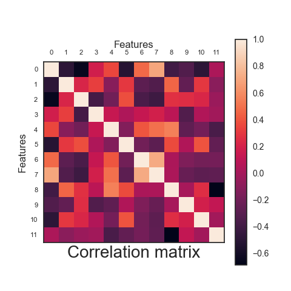
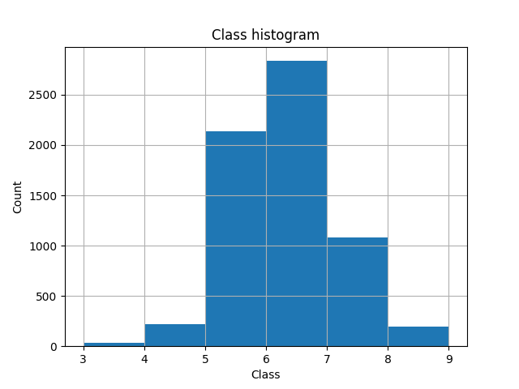
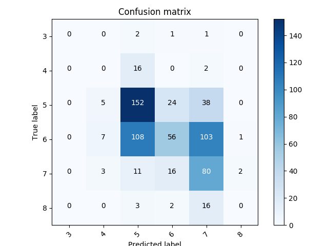

# Fine wine classification
This work looks at a famous classification problem targeting classification of Portuguese wines first presented by (see [Cortez et al., 2009](http://www3.dsi.uminho.pt/pcortez/wine/)). Red wines 1599 and 4898 white wines were classified into 7 (wine score ranging from 3 to 9) classes based on their quality and their 11 physicochemical features, in total giving 6497 wines-samples. This work presents an investigation of logistic regression classifier} and a neural network in pursuit of finding the highest accuracy, while classifying the wines.

This project was a part of coursework for module EE3-23 Machine Learning at Imperial College London, [Link](http://intranet.ee.ic.ac.uk/electricalengineering/eecourses_t4/course_content.asp?c=EE3-23&s=E3#start).

## Structure
```
.
├── Examples
├── Resources
├── Report.pdf
└── src
    ├── Figures
    ├── Linear_Classifier
    │   ├── logs
    │   └── models
    ├── Models
    ├── Neural_Network
    │   ├── logs
    │   └── models
    └── data
        ├── processed
        └── raw
```
The `Examples` directory contains mini-implementations of different methods introduced in the course. `src` Contains all the sourcecode to generate the best models for both considered models. The models are located in 2 separete directories, `Linear_Classifier` and `Neural_Network`. The final model parameters can be found under `src/Models`.

All the ourcomes are summarized in the [report](Report.pdf).

## Approach
The work presented by Cortez considered two separate methods, linear regression for classification and a shallow neural network with one hidden layer, in addition to SVMs. They have separated the data between red and white wines and the resultant accuracies with respect to the methods were: 31.2% and 31.1% for red wine and 25.6% and 26.5% for white wine.

First it was necessary to load and preprocess the data. All the data is normalized, split into n-folds for cross validaiton and testing. Below are the histogram for the score representations in the data and the correlation matrix for the given 11 features.

Correlation matrix |  Score Histogram
:-------------------------:|:-------------------------:
  |  


Each model has then been carefuly selected based on the hyperaparameter optimization. The details of which hyperaparameters, with respect to the model, have been considered can be found in `src/Models`.

## Evaluation
Overall this exploration showed that logistic regression achieved better test accuracy in solving this problem than linear regression classifier presented originally by 13.3%. Furthermore a denser neural network, with more neurons than the original implementation, improved on the test accuracy in average by 24.7%.

Confusion Matrix for Linear Method  |  Confusion Matrix for Neural Network
:-------------------------:|:-------------------------:
  |  

Further exploration of this problem could be done in the realm of transforming the features into higher dimension that could better aid the separation of quality or pre-selecting features based on statistical ranking.

## Building & Running
To train and generate all the figures for the winning models just run inside the `src` directory:

```bash
virtualenv -p python3 venv
source venv/bin/activate
pip install -r requirements.txt
python3 main.py
```
and the figures will be found in `<Method>/logs/`

## Credits
Martin Ferianc 2018.
